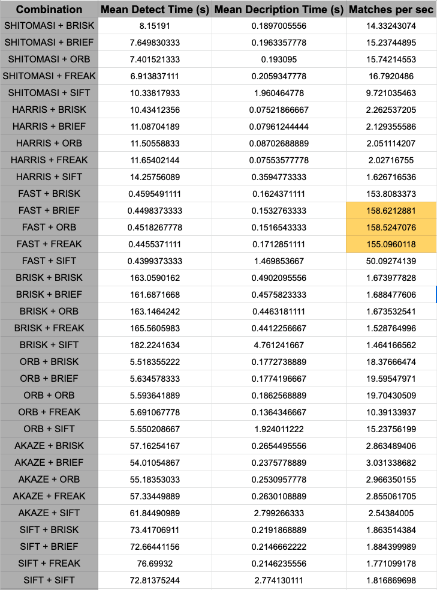

# Performance Evaluation

I made several runs with different detector + description combinations. The mean detection time, descripor time and matches per millisecond are summarized below. Taking Matches per millisecond as the comparison criteria, I conclude the three best combinations to be FAST + ORB, FAST + BRIEF and FAST + FREAK. 